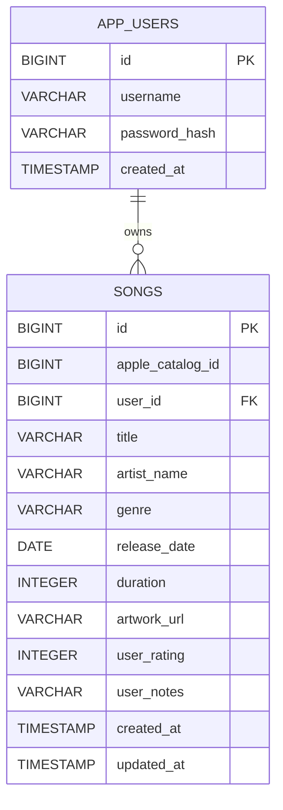

# Music Catalog Insights Platform

This repository is the starting point for the Ledger CFO take-home assignment specific info.

## Current scope

The project focuses on **songs**. Songs represent the most granular, popular, and interactive unit of a music catalog. Focusing on individual songs allows users to track their precise listening preferences (track duration), score single tracks, and get more focused analytics on specific songs rather than general albums.

### Pivot from Albums to Songs
Initially, the project was designed to catalog entire albums. However, to create a more direct, track-level personal music log, I pivoted the scope from albums to individual songs:
*   **Granularity:** Users often rate and log notes for single tracks rather than whole collections.
*   **Track Length Analytics:** Focusing on songs lets us analyze track duration distributions (e.g., short tracks under 3 minutes, medium tracks, long tracks) which is more telling than album track counts.
*   **Integration:** The public iTunes Search API is queried for `type=song` (returning track items) instead of `type=album` (returning collection items).

### Included

- Spring Boot REST API in `backend/`
- iTunes Search API proxy for song search (cached and sliced in-memory)
- H2 file-backed SQL database for a local saved library of songs
- User registration and BCrypt-hashed passwords
- JWT-protected, user-owned library CRUD endpoints for songs
- User-scoped analytics API with five song-related datasets (genre, release year, rating, artists, and duration bins)
- **AI Music Curator:** Generates a custom music archetype, a friendly critique, and 5 track recommendations based on the user's library using the `gemini-3.5-flash-lite` model.
- Validation and centralized JSON error responses
- Service-level tests for song repository and CRUD services
- Next.js UI including real-time debounced search, rating dialog, library grid pagination, and dashboard analytics

---

## Database choice & SQL Justification

The local development database is **H2** (file-backed), migrating seamlessly to **Serverless PostgreSQL (Neon.tech)** in production. 

### Why SQL was chosen over NoSQL:
1. **Relational Integrity:** There is a strict one-to-many relationship between a user profile (`AppUser`) and their saved library tracks (`Song`). Using SQL allows me to enforce foreign key constraints (`user_id` referencing `app_users.id`) with cascade operations, preventing orphaned database records.
2. **Aggregations for Analytics:** My dashboard tracks genre distributions, release years, rating frequencies, and song durations. Relational databases support mature, optimized indexing and GROUP BY aggregations, making analytics queries highly efficient.
3. **Transactional Safety (ACID):** User credentials and JWT authentication depend on reliable ACID compliance, ensuring registration and state updates are either fully committed or rolled back.
4. **Local-to-Cloud Portability:** Standard SQL/JPA configurations let me run lightweight, zero-dependency H2 databases locally and promote to production PostgreSQL with no code modifications.

---

## Database Schema

The database consists of two primary tables: `app_users` and `songs`, representing a one-to-many relationship where a user owns multiple saved songs.

### Entity Relationship Diagram



### Table Definitions

#### `app_users`
Stores user profiles and login credentials.

| Column | Type | Constraints | Description |
| --- | --- | --- | --- |
| `id` | `BIGINT` | `PRIMARY KEY`, `AUTO_INCREMENT` | Unique identifier for each user |
| `username` | `VARCHAR(50)` | `NOT NULL`, `UNIQUE` | Selected username |
| `password_hash` | `VARCHAR(100)` | `NOT NULL` | BCrypt-hashed password |
| `created_at` | `TIMESTAMP` | `NOT NULL` | Account creation timestamp |

#### `songs`
Stores track details saved to user libraries.

| Column | Type | Constraints | Description |
| --- | --- | --- | --- |
| `id` | `BIGINT` | `PRIMARY KEY`, `AUTO_INCREMENT` | Unique identifier for each saved song |
| `apple_catalog_id` | `BIGINT` | `NOT NULL` | iTunes/Apple track catalog ID |
| `user_id` | `BIGINT` | `NOT NULL`, `FOREIGN KEY` | Reference to `app_users(id)` |
| `title` | `VARCHAR(255)` | `NOT NULL` | Title of the track |
| `artist_name` | `VARCHAR(255)` | `NOT NULL` | Artist name |
| `genre` | `VARCHAR(255)` | | Genre name |
| `release_date` | `DATE` | | Release date |
| `duration` | `INTEGER` | | Track duration in milliseconds |
| `artwork_url` | `VARCHAR(1000)` | | URL to cover artwork |
| `user_rating` | `INTEGER` | | 1-5 rating score |
| `user_notes` | `VARCHAR(4000)` | | Custom review comments / personal notes |
| `created_at` | `TIMESTAMP` | `NOT NULL` | Timestamp when song was added to library |
| `updated_at` | `TIMESTAMP` | `NOT NULL` | Timestamp of last song update |

*   **Indexes & Constraints:**
    *   A foreign key constraint links `user_id` in `songs` to `id` in `app_users` with cascade delete.
    *   A unique constraint `uk_song_user_catalog_id` is defined on `(user_id, apple_catalog_id)` to prevent duplicate entries of the same song in a user's library.

---

## AI Response Schema

The Gemini AI Curator service (`/api/curator`) analyzes the user's saved song collection and returns a structured JSON response matching the following schema definition:

### JSON Schema Specification

```json
{
  "$schema": "https://json-schema.org/draft/2020-12/schema",
  "title": "CurationResponse",
  "type": "object",
  "properties": {
    "persona": {
      "type": "string",
      "description": "A 2-3 word musical personality archetype (e.g., 'Chill Indie Explorer')."
    },
    "summary": {
      "type": "string",
      "description": "A 2-3 sentence engaging breakdown of their taste and patterns, mentioning specific details from their library."
    },
    "critique": {
      "type": "string",
      "description": "A witty, slightly humorous 1-2 sentence critique of their library (friendly roast or observation)."
    },
    "recommendations": {
      "type": "array",
      "description": "A list of 5 tailored song recommendations based on their existing library.",
      "items": {
        "type": "object",
        "properties": {
          "title": {
            "type": "string",
            "description": "Title of the recommended song."
          },
          "artist": {
            "type": "string",
            "description": "Artist of the recommended song."
          },
          "rationale": {
            "type": "string",
            "description": "Explanation of why they would love this track based on specific songs in their library."
          }
        },
        "required": ["title", "artist", "rationale"]
      }
    },
    "isMock": {
      "type": "boolean",
      "description": "Flag indicating if the response is mock sample data (e.g., if the Gemini API key was not configured)."
    }
  },
  "required": ["persona", "summary", "critique", "recommendations", "isMock"]
}
```

### JSON Response Example

```json
{
  "persona": "Vibrant Melophile",
  "summary": "Your library showcases an eclectic appreciation for catchy melodies and rhythmic grooves. You have a solid rotation of distinct artists, with release dates indicating a healthy mix of modern releases and classic formats.",
  "critique": "You seem to rate almost everything 5 stars. Don't be afraid to be critical—even your favorite artists have some skips!",
  "recommendations": [
    {
      "title": "Blinding Lights",
      "artist": "The Weeknd",
      "rationale": "Matches your love for high-energy synth-pop hooks."
    },
    {
      "title": "Bohemian Rhapsody",
      "artist": "Queen",
      "rationale": "An essential masterpiece of theatrical vocal ranges and rock shifts."
    }
  ],
  "isMock": false
}
```

---


## Production Deployment Architecture

For the production environment, the platform is decoupled and hosted using modern cloud services:

*   **Backend API:** Containerized using Docker (`backend/Dockerfile`) and deployed as a Web Service on **[Render.com](https://render.com/)**.
*   **Frontend Dashboard:** Built as a static/serverless Next.js app and deployed on **[Vercel.com](https://vercel.com/)** for fast edge delivery.
*   **Database:** A serverless PostgreSQL instance hosted on **[Neon.tech](https://neon.tech/)** (neondb) to persist saved songs, library metrics, and user credentials securely.

---

## Quick start

See [BACKEND_GUIDE.md](BACKEND_GUIDE.md) and [FRONTEND_GUIDE.md](FRONTEND_GUIDE.md) for step-by-step setup and testing instructions.

From the repository root:

```bash
cd backend
mvn spring-boot:run
```

The API starts at `http://localhost:8080`. Confirm the backend is running:

```bash
curl http://localhost:8080/api/health
```

It should return `{"status": "UP"}`. Then create an account to get a JWT:

```bash
curl -X POST http://localhost:8080/api/auth/register \
  -H "Content-Type: application/json" \
  -d '{"username":"alice","password":"secure-password-123"}'
```

Use the returned `token` as a Bearer token for `/api/library` requests.

---

## API overview

| Method | Endpoint | Purpose | Auth |
| --- | --- | --- | --- |
| POST | `/api/auth/register` | Create an account and obtain a JWT | No |
| POST | `/api/auth/login` | Sign in and obtain a JWT | No |
| GET | `/api/search?query=coldplay&type=song` | Search the public iTunes song catalog (cached/sliced) | No |
| GET | `/api/library` | List/Paginate the current user's saved songs | Yes |
| POST | `/api/library` | Save a song | Yes |
| PUT | `/api/library/{id}` | Update saved song rating or notes | Yes |
| DELETE | `/api/library/{id}` | Remove a saved song | Yes |
| GET | `/api/analytics` | Summary metrics and five chart datasets for the current user's library | Yes |
| GET | `/api/curator` | Retrieve AI Curator analysis and recommendations (utilizing `gemini-3.5-flash-lite`) | Yes |

---

## Assignment alignment

- Focus: Songs, stated above with rationale.
- Schema: all requested saved-library fields are represented in the `Song` entity:
  - `id`, `apple_catalog_id` (trackId), `title` (trackName), `artist_name`, `genre`, `release_date`, `duration` (trackTimeMillis), `artwork_url`, `user_rating`, `user_notes`, `created_at`, `updated_at`.
- API: required search and CRUD routes, REST status codes, validation, and centralized errors are included.
- Authentication: BCrypt-hashed local accounts and JWT bearer-token authentication protect library reads and mutations; each user can access only their own songs.
- Analytics: the backend exposes genre, release-year, ratings, artist, and song-duration datasets for the dashboard.
- **AI Feature:** Widescreen interactive Curator Card on the dashboard generating musical personas and 5 custom track recommendations based on saved songs (utilizing `gemini-3.5-flash-lite`).

The search endpoint supports `type=song` only because songs are the declared focus.

---

## Challenges Faced

During the implementation of advanced performance and pagination features, I encountered and resolved several notable technical challenges:

### 1. The iTunes Search API "Offset" Fiasco
*   **The Problem:** I wanted to implement search pagination to optimize page sizes and prevent layout gaps on the frontend. The iTunes Search API is widely rumored in community forums to support an `offset` parameter for skipping items. However, during live testing, I found that Apple's endpoint completely ignores the `offset` query parameter when searching, returning the exact same first-page results even for `offset=12` or `offset=24`.
*   **The Fix:** I implemented a server-side slicing mechanism on the backend. The `ItunesSearchService` now fetches a larger batch of up to 40 items (the maximum limit supported by Apple) in a single request, caches the full list, and the `SearchController` dynamically slices the cached results in-memory using `allResults.subList(fromIndex, toIndex)` based on the requested `page` and `size`. This makes search page switches instantaneous, completely resolves the duplicate results issue, and drastically reduces round-trip latency.

### 2. Upstream Rate Limiting & Caching
*   **The Problem:** The iTunes Search API is rate-limited to about 20 requests per minute. With active searching, this threshold is easily breached, leading to `429 Too Many Requests` upstream errors.
*   **The Fix:** I integrated Spring Boot's `@Cacheable` abstraction on the search service. Combined with the 200-item batch fetching mentioned above, searches for the same keyword are cached locally in memory. This reduces duplicate requests to the iTunes API to near-zero, keeping the application fast and resilient.

### 3. Front-End API Spamming & Debounced Search
*   **The Problem:** Originally, catalog searches only ran on manual form submissions. When making it feel reactive, a naive search implementation would fire an API call for every keystroke. This causes high network overhead, sluggish UI response times, and race conditions where older requests complete after newer ones.
*   **The Fix:** I built a custom 500ms debouncing hook in Next.js (`frontend/app/page.tsx`). The application buffers user input and only fires the search request 500ms after the user stops typing, saving network bandwidth and creating a smooth, responsive user interface.

### 4. Database Connection String for Backend Deployment
*   **The Problem:** During backend deployment, establishing the database connection to Neon PostgreSQL required a specific connection string structure that didn't match default assumptions. I ran into initial connectivity failures due to differences in format requirements.
*   **The Fix:** I went through developer forums and official documentation to understand the correct connection string format (such as converting the serverless URL prefix to the proper JDBC protocol format). Once configured correctly in the environment variables, the backend successfully established connection to the PostgreSQL instance.

### 5. CORS Configuration and Next.js Security Vulnerability on Vercel
*   **The Problem:** Deploying the application frontend to Vercel presented two main challenges. First, CORS issues prevented the frontend from communicating with the backend API. Second, Vercel flagged a critical security vulnerability in the existing Next.js version, blocking the build from completing successfully.
*   **The Fix:** I configured CORS correctly on the Render backend service by setting the `ALLOWED_ORIGINS` environment variable to match the deployed Vercel domain. For the security blocker, I updated the Next.js version to patch the vulnerability, pulled the changes, and triggered a new deployment which built and deployed successfully.

---

## Architectural Trade-offs

During development, several strategic decisions were made to prioritize performance, developer experience, and cost limits:

1. **In-Memory Search Slicing vs. Real API Pagination**
   * *Context:* The iTunes Search API does not respect request offsets (`offset` parameter) for pagination in real-world use.
   * *Trade-off:* I fetch up to 40 results and slice them dynamically in-memory on the backend. This gives lightning-fast page transitions on the frontend. The trade-off is I cannot browse hundreds of results, but for a catalog search and curation engine, 40 highly relevant results is more than sufficient.

2. **On-Demand AI Curator vs. Database Listeners**
   * *Context:* Generating custom personas and critiques via the Gemini API.
   * *Trade-off:* I trigger the Gemini API on-demand when the user clicks the "Ask Gemini Curator" button rather than on every database change. This keeps the backend server simple, avoids unnecessary API request spam, and limits token usage, though it requires the user to wait a few seconds when requesting updated curation feedback.

3. **Monolithic Backend with Decoupled Services vs. Microservices**
   * *Context:* Structuring the backend code.
   * *Trade-off:* I built a single, clean Spring Boot container containing authentication, searching, library management, and AI services. This minimizes deployment overhead and cross-service communication issues on free tiers, though a larger application would eventually benefit from splitting out the AI and Catalog Search proxies.

4. **Event-Based In-App Slow-Request Warnings vs. Paid Warming Pinger**
   * *Context:* Preventing Render's free tier sleep mode.
   * *Trade-off:* Rather than paying for a warming server or using external ping checkers (which Render aggressively filters/blocks), I implemented client-side custom event listeners to notify users when a request exceeds 15 seconds. This keeps hosting completely free while preventing users from thinking the application is broken during cold starts.

---

> [!NOTE]
> **Production Cold Start Warning:** The production API backend is hosted on Render's free tier. If the service has been inactive for more than 15 minutes, Render spins down the server. The first request (such as signing in or registering) may suffer from a **cold start delay of 50 seconds to 1 minute** while the container boots back up. Subsequent requests will run immediately.
